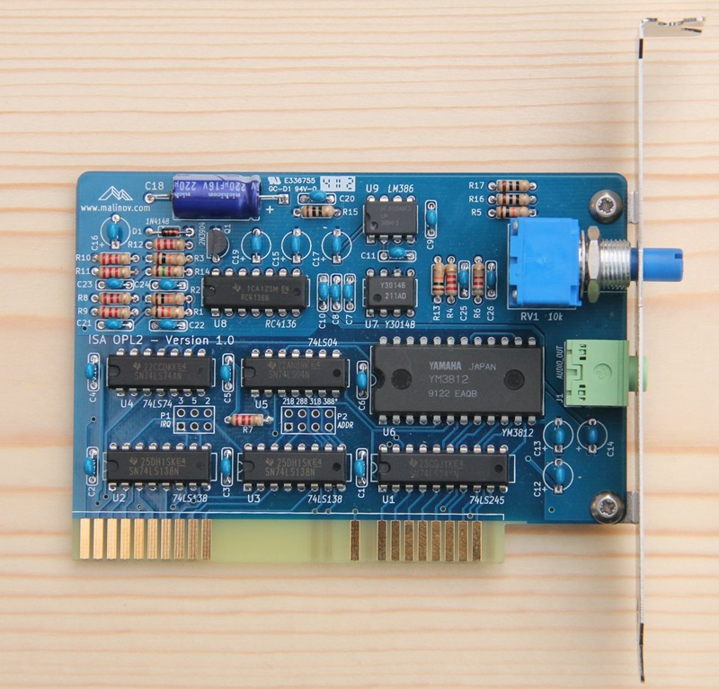

# isa-opl2

ISA OPL2 Card

## Introduction

ISA OPL2 Card is a sound card based on Yamaha OPL2 chip, officially known as YM3812. This card is compatible with the AdLib Music Synthesizer Card that was very popular in late 80's - early 90's.

## Hardware Documentation

### Schematic and PCB Layout

[Schematic - Version 1.2](KiCad/ISA_OPL2-Schematic-1.2.pdf)

[PCB Layout - Version 1.2](KiCad/ISA_OPL2-Board-1.2.pdf)

### Bill of Materials

Component Type     | Reference  | Description                                                | Quantity | Possible Sources and Notes
------------------ | ---------- | ---------------------------------------------------------- | -------- | --------------------------
PCB                |            | ISA OPL2 Version 1.2 PCB                                   | 1        | [Todd Goodman](https://retrobrewcomputers.org/doku.php?id=boardinventory) or your favorite PCB manufacturer
Integrated Circuit | U1         | 74LS245                                                    | 1        | Mouser 595-SN74LS245N
Integrated Circuit | U2, U3     | 74LS138                                                    | 2        | Mouser 595-SN74LS138N
Integrated Circuit | U4         | 74LS74                                                     | 1        | Mouser 595-SN74LS74AN
Integrated Circuit | U5         | 74LS04                                                     | 1        | Mouser 595-SN74LS04N
Integrated Circuit | U6         | YM3812                                                     | 1        | eBay
Integrated Circuit | U7         | YM3014B                                                    | 1        | eBay
Integrated Circuit | U8         | RC4136                                                     | 1        | Mouser 595-RC4136N
Integrated Circuit | U9         | LM386-3                                                    | 1        | Mouser 926-LM386N-3/NOPB
Transistor         | Q1         | 2N3904                                                     | 1        | Mouser 512-2N3904TA
Diode              | D1         | 1N4148                                                     | 1        | Mouser 512-1N4148
Capacitor          | C1 - C11   | 0.1 uF ceramic, 5.08 mm pitch                              | 11       | Mouser 810-FK28X7R1H104K
Capacitor          | C12 - C17  | 10 uF, 16V, multilayer ceramic or tantalum, 5.08 mm pitch  | 6        | Mouser 810-FK24X5R1C106K
Capacitor          | C18        | 220 uF, 16V, electrolytic, axial, 16 mm x 8 mm             | 1        | Mouser 647-TVX1C221MAD
Capacitor          | C19        | 4.7 uF, 16V, multilayer ceramic or tantalum, 5.08 mm pitch | 1	       | Mouser 810-FK24X7R1C475K
Capacitor          | C20        | 47nF, ceramic, 5.08 mm pitch                               | 1        | Mouser 810-FK24X7R2A473K 
Capacitor          | C21 - C24  | 4.7 nF, ceramic, 5.08 mm pitch                             | 4        | Mouser 810-FK28X7R1H472K
Capacitor          | C25        | 1 nF, ceramic, 5.08 mm pitch                               | 1        | Mouser 810-FK28C0G2A102J
Capacitor          | C26        | 270 pF, ceramic, 5.08  mm pitch                            | 1        | Mouser 810-FK28C0G2A271J
Resistor           | R1         | 12 k, 1/4 W                                                | 1        | Mouser 291-12K-RC
Resistor           | R2 - R5    | 10 k, 1/4 W                                                | 4        | Mouser 291-10K-RC
Resistor           | R6         | 8.2 k, 1/4 W                                               | 1        | Mouser 291-8.2K-RC
Resistor           | R7 - R13   | 2.2 k, 1/4 W                                               | 7        | Mouser 291-2.2K-RC
Resistor           | R14        | 1.5 k, 1/4 W                                               | 1        | Mouser 291-1.5K-RC
Resistor           | R15 - R17  | 10 ohm, 1/4 W                                              | 3        | Mouser 291-10-RC
Potentiometer      | RV1        | 10 k, audio, Bourns 91A1A-B24-D15L                         | 1        | Mouser 652-91A1A-B24-D15L
Connector          | J1         | Audio Connector 3.5mm, Stereo                              | 1        | Mouser STX-3120-3B-577C
IC Socket          | U7, U9     | 8 pin 300 mil DIP socket                                   | 2        | Mouser 517-4808-3000-CP
IC Socket          | U4, U5, U8 | 14 pin 300 mil DIP socket                                  | 3        | Mouser 517-4814-3000-CP
IC Socket          | U2, U3     | 16 pin 300 mil DIP socket                                  | 2        | Mouser 517-4816-3000-CP
IC Socket          | U1         | 20 pin 300 mil DIP socket                                  | 1        | Mouser 517-4820-3000-CP
IC Socket          | U6         | 24 pin 600 mil DIP socket                                  | 1        | Mouser 517-4824-6000-CP
Bracket            |            | ISA Bracket, Keystone 9202                                 | 1        | Mouser 534-9202
Screw              |            | Screw, 4-40 thread, 1/4" length                            | 2        | Mouser 534-9900

#### Replacement Notes

* 74LS logic ICs can be replaced other TTL or TTL-compatible CMOS ICs. For example these from 74ALS, 74F, 74AHCT, 74HCT, 74ACT series.
* 1/8 W resistors can be used. It is not recommended to use resistors above 1/4 W, as they have larger packages, and won't easily fit in the board.

### Construction Notes

The ISA OPL2 is relatively easy to build, and most components are widely available. YM3012 (OPL2) and YM3014B (DAC-SS) can be more tricky to get, but they are available on eBay, and from some electronic component suppliers specializing on obsolete components. Please refer to the Bill of Material below for the complete list of components. Also see attached schematic and board layout files on the bottom of this page.

#### Assembling the ISA OPL2 card

* Follow good soldering practices:
  * Clean the board with alcohol before soldering
  * Use solder with flux
  * Keep soldering iron tip clean
  * Apply the minimal amount of solder necessary to fill the hole around the lead

Start with soldering low profile components - diode and resistors
Using needle nose pliers carefully bend resistors' and diode's leads at 90 degrees angle, so that the distance between bended leads is about 7.5mm / 0.3". Be especially careful with the diode, as it is easy to break it by bending leads too close to the package - hold pliers closer to the package, and bend the lead next to the pliers. Pay attention to the diode polarity. The diode has a black stripe that goes around the package, this stripe indicates the cathode, and it should match the orientation of the stripe on the board's silkscreen. The resistors have different resistance marked by the color codes - Google it if you are not familiar with these codes.

Continue with the capacitors (except of C18). If you are using polarized (electrolytic or tantalum) capacitors, pay attention to their polarity. Electrolytic capacitors usually have a stripe with minus (-) signs that indicate the negative lead, the board has positive pin marked with (+). Tantalum capacitors usually have a small plus (+) sign near the positive lead. Capacitance is usually marked explicitly on electrolytic capacitors (e.g. 10 uF), while ceramic and tantalum capacitors use exponential notation in format NNE. To calculate the capacitance use NN * 10 ^ E formula. For example 104 means 10 * 10 ^ 4 = 100,000 pF or 0.1 uF.

Solder the Q1 transistor, make sure it is oriented correctly (package matches the drawing on the silk screen).

Next solder IC sockets (or ICs directly if you're brave). Pay attention to the sockets/ICs orientation. The first lead is marked on the silkscreen with a notch. Sockets usually have similar notch, ICs might have either notch or dot near 1 pin or frequently both of them. I usually solder two opposite pins first while applying slight pressure to the socket/IC so it sits firmly on the board. Then I check that socket/IC is indeed oriented correctly (in case it is not oriented correctly, it is not very difficult to desolder it at this stage), and solder the rest of pins.

Finally solder taller components - C18 capacitor, headphone socket J1, and the potentiometer RV1.

Carefully inspect all solder joins. Resolder any missing or questionable joins.

It is recommended to clean the flux from the finished board with alcohol. I use a toothpick to remove the excessive flux, and the 91% rubbing/isopropyl alcohol, and an old toothbrush to clean the board. Let the alcohol to dry before continuing.

If using sockets - insert ICs to sockets at this stage. Pay attention to the ICs orientation. It is usually necessary to bend IC pins a bit, so they will fit in the socket. Do that by gently pressing ICs against a firm surface (table, ruler). If you overbend them, use a metal ruler to bend them back by placing the ruler between pins and the package, pressing the ruler against a firm surface and applying a slight pressure to the package.

#### Drilling the mounting bracket

First measure and mark holes' positions with a permanent marker or a metal scriber. Next use a center punch or a large screw with pointy tip and a small hammer to mark holes' centers. Place the bracket on a piece of wood, and secure it with a clamp. Start drilling with a small drill diameter gradually increasing the drill diameter. Use low speed then drilling larger diameters, do not apply to much pressure, or the bracket will bend. The final diameter should be about 7 mm - 8 mm (5/16") for both holes.
